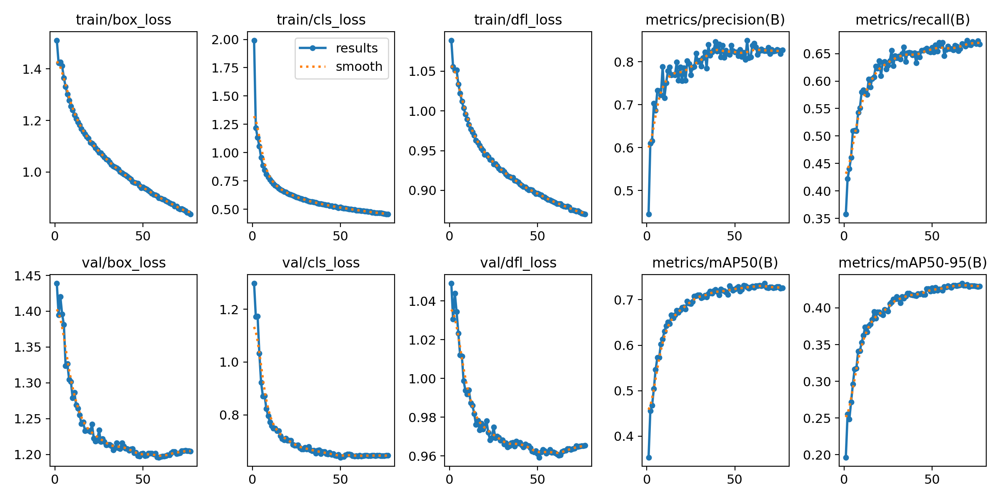

# Traffic Object Detection Model



## Overview
This project contains a machine learning model for detecting and classifying traffic-related objects in images. It can recognize vehicles, pedestrians, traffic lights, and various traffic signs, making it suitable for applications like autonomous driving, traffic monitoring, and smart city solutions.

The model can detect the following classes:

| ID | Class Name |
|----|------------|
| 0  | Car |
| 1  | Different-Traffic-Sign |
| 2  | Green-Traffic-Light |
| 3  | Motorcycle |
| 4  | Pedestrian |
| 5  | Pedestrian-Crossing |
| 6  | Prohibition-Sign |
| 7  | Red-Traffic-Light |
| 8  | Speed-Limit-Sign |
| 9  | Truck |
| 10 | Warning-Sign |

---

## Features
- Real-time object detection for traffic scenes.
- Multi-class classification including vehicles, pedestrians, and traffic signs.
- Output includes class labels and bounding boxes.
- Easily integratable into Python pipelines or applications.

---

## Model Training

- **Framework**: YOLOv8n  
- **Training Dataset**: Polish traffic dataset with 10,000 training images and 1,000 validation images  
- **Evaluation Metrics**:
  - **mAP50-95**: 0.4333  
  - **mAP50**: 0.73608  

The model was trained to optimize accuracy while maintaining fast inference, making it suitable for real-time applications.

---

## Quick Start

Run the following commands to get the project running quickly:

```bash
# Clone the repository
git clone https://github.com/ssbodea/YOLO-Road-Detection.git
cd YOLO-Road-Detection

# Create a Python virtual environment
python -m venv venv

# Activate the virtual environment
# Windows:
venv\Scripts\activate
# Mac/Linux:
source venv/bin/activate

# Install dependencies
pip install -r requirements.txt
